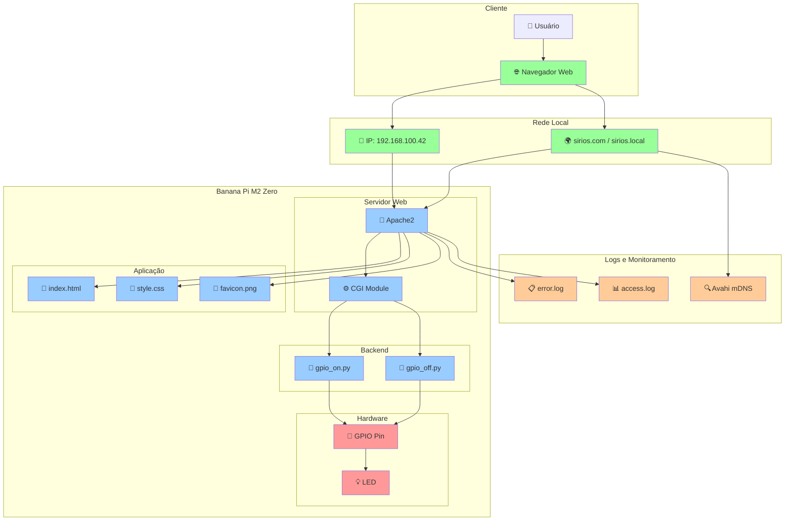
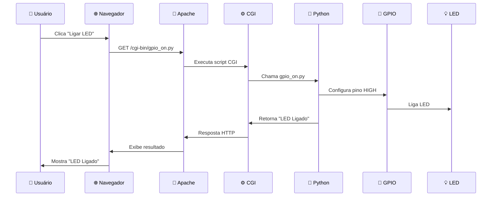
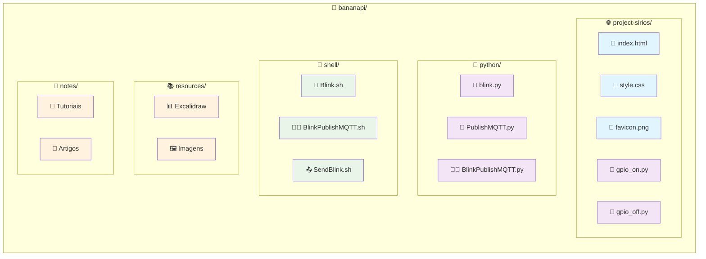
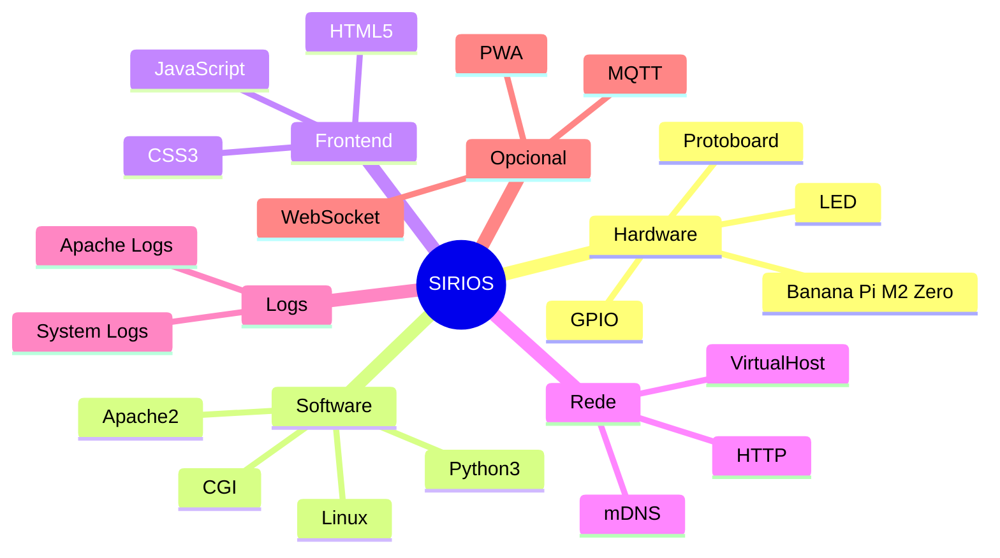
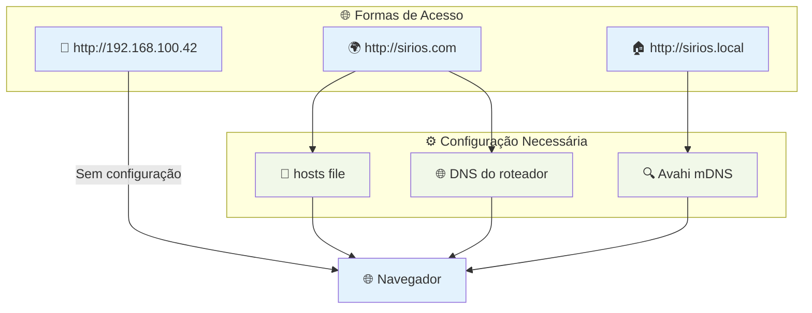

# SIRIOS - Visão Panorâmica do Projeto

## Diagrama de Arquitetura

```mermaid
graph TB
    subgraph "Cliente"
        Browser[🌐 Navegador Web]
        User[👤 Usuário]
    end
    
    subgraph "Rede Local"
        IP[📍 IP: 192.168.100.42]
        Domain[🌍 sirios.com / sirios.local]
    end
    
    subgraph "Banana Pi M2 Zero"
        subgraph "Servidor Web"
            Apache[🔄 Apache2]
            CGI[⚙️ CGI Module]
        end
        
        subgraph "Aplicação"
            HTML[📄 index.html]
            CSS[🎨 style.css]
            Favicon[🔖 favicon.png]
        end
        
        subgraph "Backend"
            ScriptOn[🐍 gpio_on.py]
            ScriptOff[🐍 gpio_off.py]
        end
        
        subgraph "Hardware"
            GPIO[🔌 GPIO Pin]
            LED[💡 LED]
        end
    end
    
    subgraph "Logs e Monitoramento"
        ErrorLog[📋 error.log]
        AccessLog[📊 access.log]
        Avahi[🔍 Avahi mDNS]
    end
    
    %% Fluxo principal
    User --> Browser
    Browser --> IP
    Browser --> Domain
    IP --> Apache
    Domain --> Apache
    
    Apache --> CGI
    CGI --> ScriptOn
    CGI --> ScriptOff
    
    ScriptOn --> GPIO
    ScriptOff --> GPIO
    GPIO --> LED
    
    %% Arquivos estáticos
    Apache --> HTML
    Apache --> CSS
    Apache --> Favicon
    
    %% Logs
    Apache --> ErrorLog
    Apache --> AccessLog
    Domain --> Avahi
    
    %% Estilos
    classDef hardware fill:#ff9999
    classDef software fill:#99ccff
    classDef network fill:#99ff99
    classDef logs fill:#ffcc99
    
    class GPIO,LED hardware
    class Apache,CGI,ScriptOn,ScriptOff,HTML,CSS,Favicon software
    class IP,Domain,Browser network
    class ErrorLog,AccessLog,Avahi logs
```

## Fluxo de Funcionamento

```mermaid
sequenceDiagram
    participant U as 👤 Usuário
    participant B as 🌐 Navegador
    participant A as 🔄 Apache
    participant C as ⚙️ CGI
    participant P as 🐍 Python
    participant G as 🔌 GPIO
    participant L as 💡 LED
    
    U->>B: Clica "Ligar LED"
    B->>A: GET /cgi-bin/gpio_on.py
    A->>C: Executa script CGI
    C->>P: Chama gpio_on.py
    P->>G: Configura pino HIGH
    G->>L: Liga LED
    P->>C: Retorna "LED Ligado"
    C->>A: Resposta HTTP
    A->>B: Exibe resultado
    B->>U: Mostra "LED Ligado"
```

## Componentes do Repositório

```mermaid
graph LR
    subgraph "📁 bananapi/"
        subgraph "🌐 project-sirios/"
            HTML[📄 index.html]
            CSS[🎨 style.css]
            Favicon[🔖 favicon.png]
            ScriptOn[🐍 gpio_on.py]
            ScriptOff[🐍 gpio_off.py]
        end
        
        subgraph "🐍 python/"
            Blink[💫 blink.py]
            MQTT[📡 PublishMQTT.py]
            BlinkMQTT[💫📡 BlinkPublishMQTT.py]
        end
        
        subgraph "🔧 shell/"
            BlinkSH[💫 Blink.sh]
            BlinkMQTTSH[💫📡 BlinkPublishMQTT.sh]
            SendBlink[📤 SendBlink.sh]
        end
        
        subgraph "📚 resources/"
            Diagrams[📊 Excalidraw]
            Images[🖼️ Imagens]
        end
        
        subgraph "📝 notes/"
            Tutorials[📖 Tutoriais]
            Articles[📰 Artigos]
        end
    end
    
    classDef frontend fill:#e1f5fe
    classDef backend fill:#f3e5f5
    classDef scripts fill:#e8f5e8
    classDef docs fill:#fff3e0
    
    class HTML,CSS,Favicon frontend
    class ScriptOn,ScriptOff,Blink,MQTT,BlinkMQTT backend
    class BlinkSH,BlinkMQTTSH,SendBlink scripts
    class Diagrams,Images,Tutorials,Articles docs
```

## Tecnologias Utilizadas

```mermaid
mindmap
  root((SIRIOS))
    Hardware
      Banana Pi M2 Zero
      GPIO
      LED
      Protoboard
    Software
      Linux
      Apache2
      Python3
      CGI
    Frontend
      HTML5
      CSS3
      JavaScript
    Rede
      HTTP
      mDNS
      VirtualHost
    Logs
      Apache Logs
      System Logs
    Opcional
      MQTT
      WebSocket
      PWA
```

## URLs de Acesso

```mermaid
graph TD
    subgraph "🌐 Formas de Acesso"
        IP[📍 http://192.168.100.42]
        Domain[🌍 http://sirios.com]
        Local[🏠 http://sirios.local]
    end
    
    subgraph "⚙️ Configuração Necessária"
        Hosts[📝 hosts file]
        DNS[🌐 DNS do roteador]
        Avahi[🔍 Avahi mDNS]
    end
    
    IP --> |"Sem configuração"| Browser[🌐 Navegador]
    Domain --> Hosts
    Domain --> DNS
    Local --> Avahi
    
    Hosts --> Browser
    DNS --> Browser
    Avahi --> Browser
    
    classDef access fill:#e3f2fd
    classDef config fill:#f1f8e9
    
    class IP,Domain,Local,Browser access
    class Hosts,DNS,Avahi config
```

